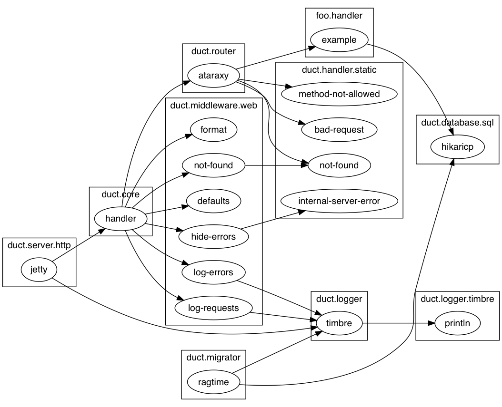

# duct-viz

A Leiningen plugin to present a dependency diagram of [Duct framework](https://github.com/duct-framework/duct) based app.

## Usage

Put `[duct-viz "0.1.0"]` into the `:plugins` vector of your project.clj.

```bash
$ lein duct-viz -m
Usage: lein duct-viz [options]
    
Options:
  -d, --duct-file DUCT_FILE      config.edn  Duct config file.
  -o, --output-file OUTPUT_FILE  system.png  Output file path, png image.
  -v, --vertical                             Use vertical layout.
  -m, --man                                  Help.
```

Here's an example of a project using `lein new duct foo +api +ataraxy +example +sqlite` template:



## License

Copyright © 2017 Quan

Distributed under the Eclipse Public License either version 1.0 or (at
your option) any later version.
